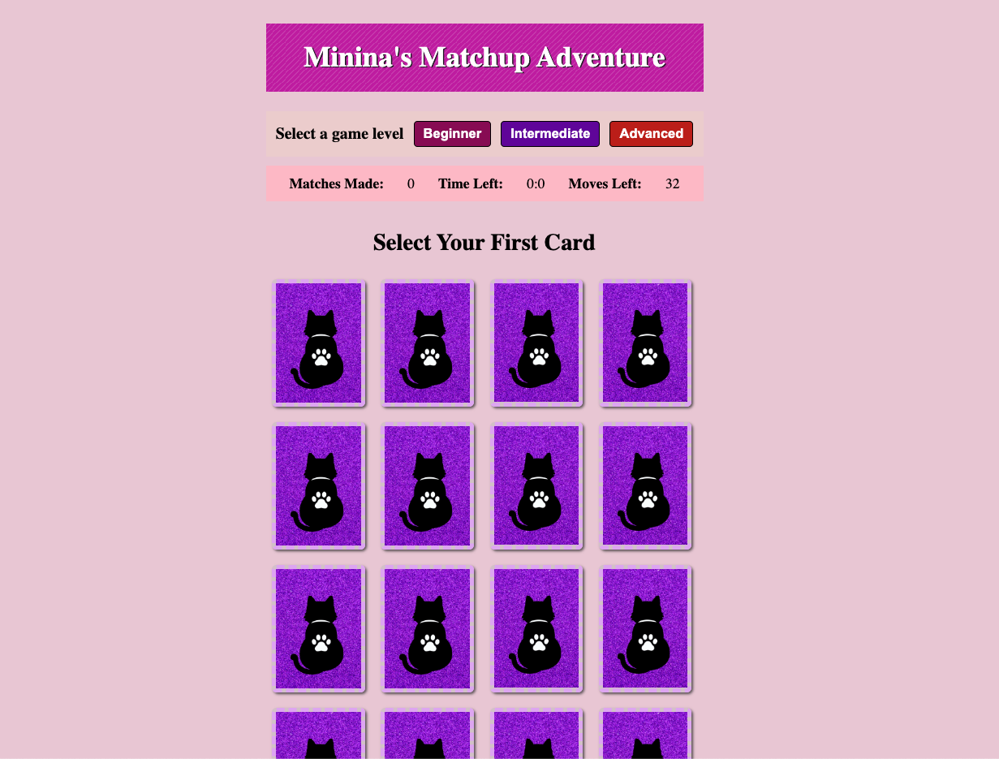

# Minina's Matchup Adventure

### Background:
**"Minina's Matchup Adventure"** was conceived out of a passion for memory games and a desire to showcase the charm of my cat, Minina. This game embodies a perfect fusion of these two elements, offering an engaging and delightful experience.

A little bit about Minina: she's a 6-year-old female American Shorthair rescue cat who adores treats, appreciates the occasional hug, and finds pure bliss in her favorite pastime—napping. 🐾

***
### Getting Started:
To embark on this exciting adventure, <em><strong>click the link below </strong></em> to play the game. 

[Play Minina's Matchup Adventure](https://www.carla-minina-match-game.netlify.app/)

Your mission, should you choose to accept it, is to match all of the cards on the screen before the timer runs out and before you're out of moves. Minina's watchful eye is on you as the timer ticks down, and you'll need to sharpen your memory and quick thinking to succeed. 

The game contains three levels to choose from, and you may start at any of them.

#### Game Rules:
Follow these instructions to prove you're the ultimate cat-themed card matcher!

1. Start by choosing a card.
After selecting your first card, choose another one.
2. If the cards match, you earn a point, and both cards stay face up.
Keep making matches to earn more points.
3. If you choose two cards that don't match, the second card will flip back over, and you'll lose a move.
4. Every successful match keeps the cards face up and earns you points.
5. Win by collecting all the cards before you run out of moves or the timer runs out.

#### Levels:

1. Level 1: Beginner

     Generate 8 matches (16 cards total) within 10 minutes, and use no more than 32 moves.

2. Level 2: Intermediate

    Generate 18 matches (36 cards total) within 6 minutes, and use no more than 62 moves.

3. Level 3: Advanced

    Generate 40 matches (80 cards total) within 4 minutes, and use no more than 42 moves.

***
### Credits   /  Attributions: 🙌

#### Card Visuals:
* Front of the Cards: Photography by Carla Pacheco Muevecela & Henry Zambrano
* Back of the Cards: Cat-themed card illustrations by Carla Pacheco Muevecela using Canva

#### Sound Effects:
* Sound Effect 1 - Placeholder for Sound Effect 1
* Sound Effect 2 - Placeholder for Sound Effect 2
* Sound Effect 3 - Placeholder for Sound Effect 3
* Sound Effect 4 - Placeholder for Sound Effect 4

#### Animations:
* Confetti Animation - Attribution for the confetti animation
* Animation Placeholder 1 - Placeholder for Animation 1
* Animation Placeholder 2 - Placeholder for Animation 2
* Animation Placeholder 3 - Placeholder for Animation 3
***
### Technologies Used 💾
* JavaScript
* HTML
* CSS
***
### Next Steps:
We're not done yet! Here are some planned enhancements for "Minina's Matchup Adventure":

* Assign each level their own theme - css updates to come!
* Add new levels with new challenges.

Stay tuned for these exciting updates! 🐾😸🃏