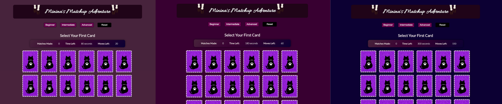

# Minina's Matchup Adventure

### Background:
**"Minina's Matchup Adventure"** was conceived out of a passion for memory games and a desire to showcase the charm of my cat, Minina. This game embodies a perfect fusion of these two elements, offering an engaging and delightful experience.

A little bit about Minina: she's a 6-year-old female American Shorthair rescue cat who adores treats, appreciates the occasional hug, and finds pure bliss in her favorite pastime—napping. 🐾

#### Click to view [planning materials](https://docs.google.com/document/d/1LU7e4GeqqU1XGib3m1bBqbqHcjbGeta1vEV4Z5cTEyI/edit)
***
### Getting Started:
To embark on this exciting adventure, <em><strong>click the link below </strong></em> to play the game. 

### [Play Minina's Matchup Adventure](https://carla-minina-match-game.netlify.app/)

Your mission, should you choose to accept it, is to match all of the cards on the screen before the timer runs out and before you're out of moves. Minina's watchful eye is on you as the timer ticks down, and you'll need to sharpen your memory and quick thinking to succeed. 

The game contains three levels to choose from, and you may start at any of them.

#### Game Rules:
Follow these instructions to prove you're the ultimate cat-themed card matcher!

1. Start by choosing a card.
After selecting your first card, choose another one.
2. If the cards match, you earn a point, and both cards stay face up.
Keep making matches to earn more points.
3. If you choose two cards that don't match, the second card will flip back over, and you'll lose a move.
4. Every successful match keeps the cards face up and earns you points.
5. Win by collecting all the cards before you run out of moves or the timer runs out.

#### Levels:

1. Level 1: Beginner

     Generate 6 matches (12 cards total) within 80 seconds, and use no more than 20 moves.

2. Level 2: Intermediate

    Generate 12 matches (24 cards total) within 180 seconds, and use no more than 60 moves.

3. Level 3: Advanced

    Generate 21 matches (42 cards total) within 300 seconds, and use no more than 150 moves.

***
### Credits   /  Attributions: 🙌

#### Card Visuals:
* Front of the Cards: Photography by Carla Pacheco Muevecela & Henry Zambrano
* Back of the Cards: Cat-themed card illustrations by Carla Pacheco Muevecela using Canva

#### Sound Effects:
* Sound Effect 1 - [Cat Scream by InspectorJ on Free Sounds](https://freesound.org/people/InspectorJ/sounds/415209/)
* Sound Effect 2 - [Digital Alarm from Tempouser on Free Sounds](https://freesound.org/people/Tempouser/sounds/123349/)
* Sound Effect 3 - [Purr from Mafon2 on Free Sounds](https://freesound.org/people/Mafon2/sounds/436542/)
* Sound Effect 4 - [Win Slot Machine from LittleRobotSoundFactory on Free Sounds](https://freesound.org/people/LittleRobotSoundFactory/sounds/274180/) 

#### Animations:
* Animation 1 - [Animate Jello by Animate.Style](https://animate.style/)

***
### Technologies Used 💾
* JavaScript
* HTML
* CSS
***
### Icebox: 🧊
* Assign each level their own theme - css updates to come!
* Add new levels with new challenges.
* Add responsive design to accomodate mobile devices.

Stay tuned for these exciting updates! 🐾😸🃏